MultiMail Screen Shots
======================

Default color scheme, MS-DOS version
------------------------------------

From DOSEmu in X.

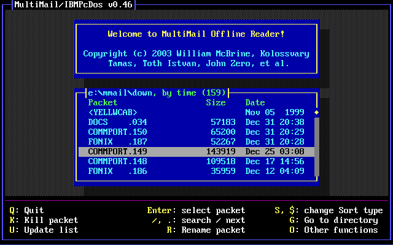
Startup screen -- packet list

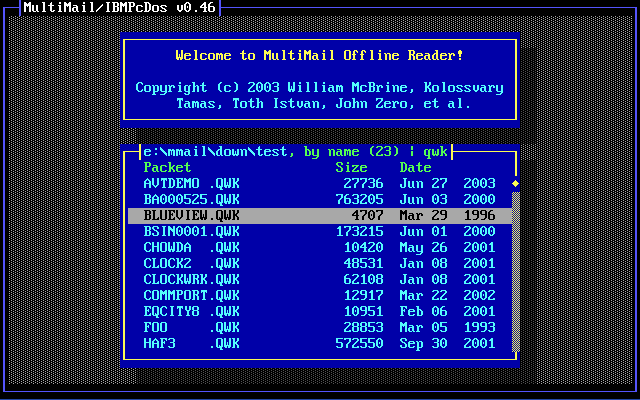
With a filter, in expert mode

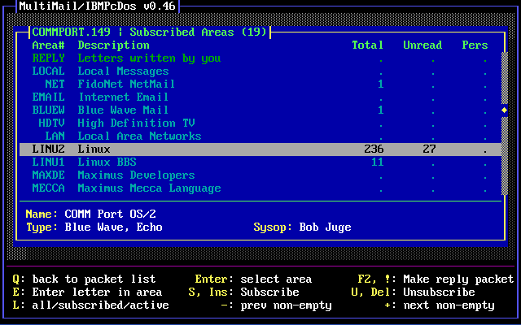
Area list, Blue Wave

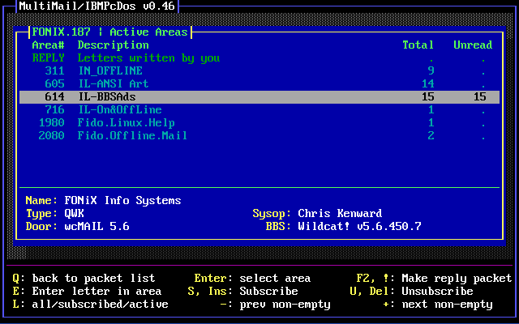
Area list, QWK

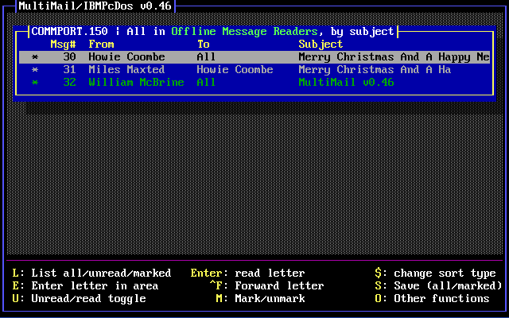
Letter list, BBS

Letter list, Usenet

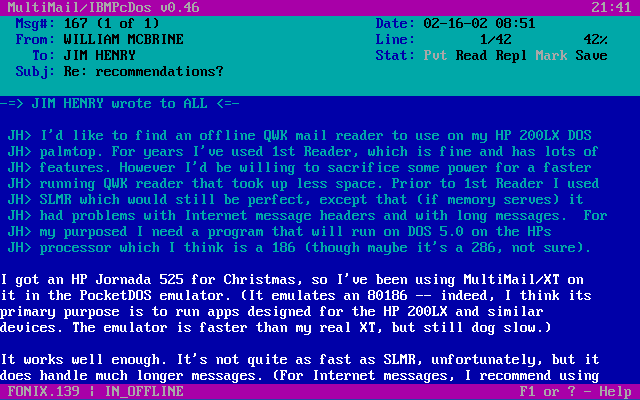
Letter window

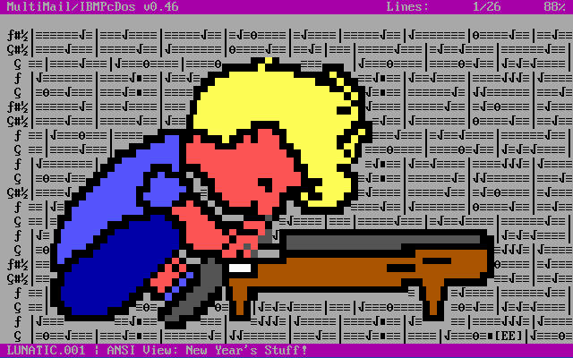
ANSI viewer

---

Aqua color scheme, Linux version, in xterm
------------------------------------------

An example of a light-background scheme. This xterm was started with "-fn
vga -tn linux" -- useful for viewing ANSI pics.

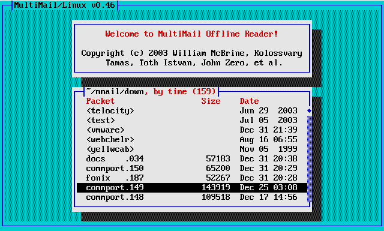
Startup screen -- expert mode

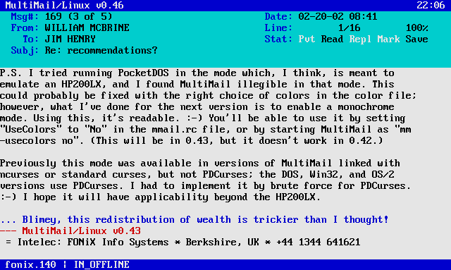
Letter window

---

With transparency, in Eterm
---------------------------

New in 0.39 -- whichever color is defined as the background in "Main_Back"
becomes transparent. (Version 0.38 always made Black the transparent
color.) This can be used to good effect with a light-background scheme like
aqua.col. Here I'm using the standard iso-8859-1 character set, 10x20
font.

| -:- | -:- |
| 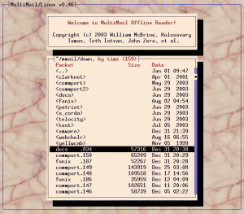 | 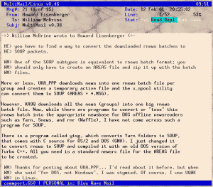 |
| Startup screen -- expert mode | Letter window |

The standard color scheme, but with the background set to blue and made
transparent. (Click for full-size versions.)

| -:- | -:- |
| 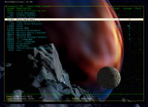 | 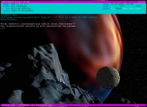 |
| Area list -- expert mode | Letter window |

---

Not all terminals are created equal
-----------------------------------

The pictures at the top of this page show what MultiMail is _supposed_
to look like, but some terminals lack support for color, the special
box-drawing characters, or both. In many cases, this isn't really the fault of
the terminal, but of the corresponding entry in the terminfo database --
you can sometimes edit that to fix the problem. In other cases, changing the
font can help. Anyway, the "lowest common denominator" MultiMail display looks
something like this (contributed by Alan Zisman -- click for full-size
version):

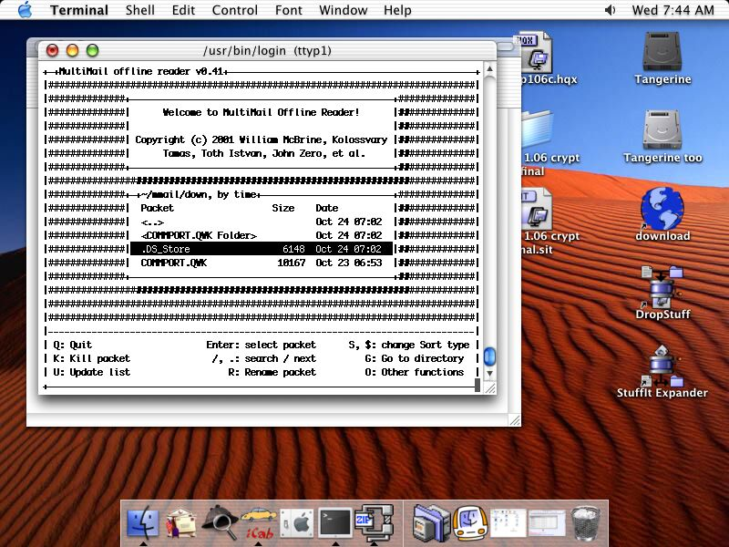
MultiMail running under Macintosh OS X, aka Darwin

I'm happy to report that performance under Mac OS X's Terminal has
improved since that snapshot was taken; colors and box-drawing
characters now work. (The background is still made up of octothorpes,
but that's the same as in xterm without the "-fn vga -tn linux". I
should probably work on that.)

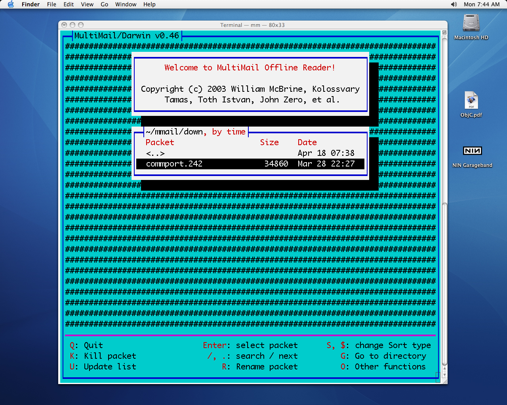
With OS X 10.3.9
