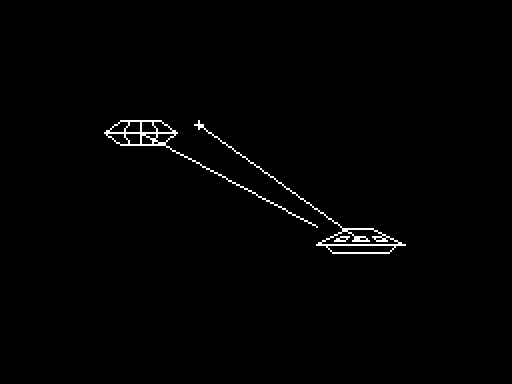

Saucer: A Space Duel
====================

Originally written over a weekend when I was in seventh grade. Saucer
needs a TRS-80 Color Computer with Extended BASIC, at least 16K of RAM,
and two (!) joysticks. It probably can't be played in an emulator,
because of the control system. (The screenshot here is a mock-up,
accurate but enlarged.)

Your enemy is a flying saucer, similar to your own. It fires back only
when fired upon, but it also moves, randomly, and you have to move out
of the way. Six shots destroy the enemy; three shots, or one contact,
destroy you. One joystick controls the position of your ship (for
running away), and the other your crosshairs (for firing). Unlike in
most games, the joystick is used to set absolute positioning rather than
direction (so, turn off auto-homing, if applicable).

You either win the game, or lose -- there's no scoring, just a duel.
(Note: There's no relation between this and the Atari game "Space Duel",
which I learned of much later.)

The version here isn't the original. I had a variety of undated versions
(no dates on the CoCo!) across multiple cassette tapes. Around 1997
(when Saucer was already about 15 years old), I put together the best
bits and cleaned it up a little. (It could still use a little more
cleaning.) But it looks and plays the same.



---
*[Home](https://wmcbrine.com/)*
