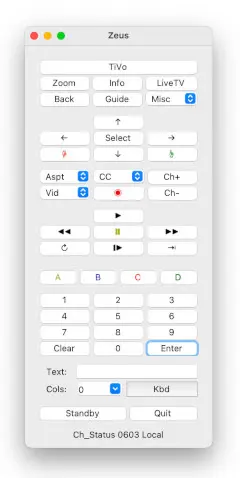
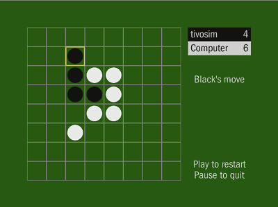

Projects for the [TiVo]®
========================

These require [Python] 2.x, unless otherwise noted. All except Reversi are
open source, with code repositories available on [GitHub]. Most of these
projects originated in TiVo Community Forum threads, where they were first
distributed as attachments. (I used to link to those threads here, but
those links no longer work.)

Please note that I'm not (and have never been) an employee of TiVo Inc.,
and these aren't TiVo products.


Network Remote Control for TiVo
-------------------------------



A GUI, network-based virtual TiVo remote control for your computer, for
Series 3 and up. Unlike the full-featured iOS and Android apps provided
by TiVo Inc., this program merely simulates the functions of the
hand-held "peanut" remote. But it will run on your laptop, desktop PC,
or even [your old PDA]; and it depends only on the local network, not an
Internet connection.

Controllable TiVos on your network are detected automatically, when
possible; or you can specify an address.

Shortcut keys are available for most operations. Direct text input is
available for those parts of the TiVo interface that support it, and for
those that don't, the Network Remote can navigate the "Ouija board" and
enter text automatically. Closed captions can be toggled with a single
button press. These features make the Network Remote faster in use than
an infrared hand-held.

Tested on Windows, macOS, Linux, and other platforms. The GUI works with
either Tkinter _or_ GTK, at your option (and depending on what's
available).

This app is compatible with Python 3. (The macOS app includes the
interpreter.)

Although the "Crestron" interface used here is [now officially (though
incompletely) documented][remdoc], I developed this program based on
discoveries by TCF user Omikron.

* [Download version 0.33][remote]
* [macOS app]
* [Demo video]

<!-- I can't recommend this version anymore
[][appstore]
-->

### Remote Proxy for TiVo

An intermediary between the TiVo and remote control apps ("Crestron"
interface only) that allows multiple clients to connect at once; it can
also monitor the traffic on the console.

While the Network Remote and Remote Proxy include features to support
each other, Remote Proxy will work with any (old-style) TiVo remote
app.

This program is compatible with Python 3.

* [Download version 0.7][rproxy]


pyTivo
------

An alternative to TiVo Desktop Plus, pyTivo is an HMO server, that can
transfer video to and from the TiVo (Series 2 or later), and previously
could also provide music and photos to the TiVo. With the help of
[FFmpeg], it can transcode videos from a wide variety of sources to a
TiVo-compatible format, on the fly.

Despite the similar names, HMO is unrelated to the later HME (q.v.,
below), and has survived better; but it, too, has been increasingly
crippled over the years. pyTivo's main function -- transferring video to
the TiVo -- doesn't work in the latest TiVo UI (which means it can never
work on the TiVo Edge). "Push" transfers, to the TiVo but initiated from
the pyTivo side, have been completely broken for some time, along with
photos and music. Transfers _from_ the TiVo still work, for now.

pyTivo was created by Jason Michalski, and over the years has
incorporated the work of many collaborators. I only maintain one
fork.

* [My pyTivo fork]
* [HMO] (Home Media Option) specification
* [TiVo Connect Discovery] -- the pre-Zeroconf method for TiVos and HMO
  servers to find each other on the LAN


tivodecode-ng
-------------

tivodecode-ng ("ng" for "next generation") is a portable command-line
tool for decrypting .TiVo video files into program streams or transport
streams, depending on the source. It also will decrypt the metadata
(title, description, etc.). It's based on tivodecode by Jeremy Drake,
with enhancements by several contributors. tivodecode-ng adds support
for transport streams, although that's a work in progress. (Note that
support for program streams is as complete as ever.)

tivodecode-ng is written in C++ (no Python dependencies).

* [Download version 0.5][tdng]


Inactive / Obsolete Projects
----------------------------

No longer functional due to changes made by TiVo, this code is here for
reference. These depend on the old HME interface.


### HME for Python

```
import hme

TITLE = 'Hello World'

class Hello(hme.Application):
    def startup(self):
        hme.Font(self, size=36, style=hme.FONT_BOLD)
        self.root.set_text('Hello, world!')
```

An alternative to TiVo's Java-based [HME SDK], this package helped you
to develop HME applications in Python. Note that doing so nowadays is a
quixotic undertaking, which I can no longer recommend.

[LGPL 2.1]+, except where noted. (Most of the example apps are ported
from TiVo's SDK, and as such are under the [Common Public License].)
More of a framework than a library. Python 2.x only, where x >= 3.

HME for Python included some features not available in publicly
released versions of the Java SDK, such as (with Series 3 or later
TiVos) an easy method of changing resolutions between SD and HD, and
support for direct text input.

Besides HME/VLC and Reversi, HME for Python was also used in [Jeff
Bernardis]' "Jukebox" and "pyTivo Video Manager".

* [Download version 0.20][hme4py]
* [HME] (Home Media Engine) specification


### HME/VLC video streamer


The first third-party HME app to take advantage of the undocumented
video streaming capability found in Series 3 and later TiVos, as seen
for example in the YouTube viewer. Surpassed in some respects by
[Streambaby], but where Streambaby only handled locally-hosted files,
HME/VLC also supported live Internet streams, and video podcast RSS
feeds.

In addition to Python, as the name suggests, HME/VLC depended on [VLC
Media Player][VLC] to transcode files and streams that weren't already
in a TiVo-compatible format. Starting this project after having worked
on pyTivo, I wanted something that would be easier for end-users to set
up than FFmpeg. VLC also offered a built-in streaming capability of its
own. But the results were mixed, with subsequent versions of VLC
breaking required features, and then only partially restoring them.

Many of the streams have been discontinued since the last release of
HME/VLC, with no replacements available.

* [Download version 3.6][hmevlc]


### Reversi



The classic board game -- you could play against the computer, or
against another human player, if one was online. Written using HME for
Python, this was technically the first HD-capable game for TiVo
(although the graphics were plain).

The routine that determined the set of legal moves was adapted from
Brent Burley's [Reversi.py], and the computer's strategy from Mark
Williams' "Positional" strategy for the same program. Some ideas were
drawn from the now-extinct PlayTeeVee version of Reversi for the TiVo.
(I chose the strategy for its low computational overhead rather than its
strength; it was, however, a slightly stronger player than PlayTeeVee's
was.)

Reversi ran for nearly a decade, eventually becoming unavailable to
new TiVos when their "Add an App" feature was broken, and finally shut
down when I lost my old static IP. (Adding apps had relied on IPs rather
than domain names, presumably for ease of entry via the remote, but
complicating hosting.)

---
*[Home]*

[remote]: https://github.com/wmcbrine/tivoremote/archive/refs/tags/0.33.zip
[hme4py]: hme-python-0.20.zip
[hmevlc]: hme-vlc-3.6.zip

[rproxy]: https://github.com/wmcbrine/rproxy/archive/refs/tags/0.7.zip
[tdng]: https://github.com/wmcbrine/tivodecode-ng/releases/tag/0.5

[TiVo]: https://www.tivo.com/
[HMO]: HMO.md
[TiVo Connect Discovery]: TCD.md
[HME SDK]: http://tivohme.sourceforge.net/
[HME]: HME.md
[remdoc]: https://github.com/RogueProeliator/IndigoPlugin-TiVo-Network-Remote/blob/master/Documentation/TiVo_TCP_Network_Remote_Control_Protocol.pdf

[Python]: https://www.python.org/
[FFmpeg]: https://ffmpeg.org/
[VLC]: https://www.videolan.org/vlc/index.html
[Streambaby]: https://code.google.com/p/streambaby/

[GitHub]: https://github.com/wmcbrine/
[My pyTivo fork]: http://pytivo.org/
[macOS app]: https://github.com/wmcbrine/tivoremote/releases/download/0.33/network-remote-0.33b.dmg
[appstore]: https://itunes.apple.com/us/app/network-remote-for-tivo/id914331224?ls=1&amp;mt=12
[Demo video]: https://youtube.com/watch?v=OSAPzpQ9j6I

[your old PDA]: remote-wince.webp

[LGPL 2.1]: https://www.gnu.org/licenses/lgpl-2.1.html
[Common Public License]: https://en.wikipedia.org/wiki/Common_Public_License

[Jeff Bernardis]: https://github.com/jbernardis
[Reversi.py]: https://github.com/wilbeibi/AI_Reversi/blob/master/reversi.py

[Home]: https://wmcbrine.com/
